# 🎯 SURSETU — Pitch & Demo Guide
## Bridging Indigenous Languages & Primary Education Through Offline Edge Computing

---

## Slide 1: Title & Hook
**Title:** 🌿 **SURSETU** (सुर सेतु • ᱥᱩᱨ ᱥᱮᱛᱩ • ପଳᱟଶ ସେତୁ)  
**Subtitle:** Offline-First Indigenous Translation & Primary Education Platform for Tribal India  
**Tagline:** *Preserving Indigenous Heritage • Empowering Every Tribal Classroom • 100% Offline*  
**Presenter:** Project Lead & Engineering Team  
**Key Visual:** A vibrant illustration of a tribal classroom under a SurSetu (Flame of the Forest) tree, connecting children with tablets displaying Ol Chiki, Odia, and Hindi.

> **Speaker Note:**  
> "Good morning, esteemed jury members and delegates. Today, over 10 million tribal children in India walk into classrooms where they do not understand the language spoken by their teachers. We are proud to present SurSetu—an offline-first, high-precision translation and primary education bridge built specifically for indigenous languages: Santali, Mundari, and Ho."

---

## Slide 2: The Core Problem — The "Linguistic Chasm"
### 3 Critical Bottlenecks in Tribal Education
1. **Classroom Disconnect:** Children speak Santali or Ho at home; school textbooks and teachers use Standard Hindi or Odia. Early comprehension collapses.
2. **Multi-Script Fragmentation:** Santali is written in **Ol Chiki**, **Odia Script**, and **Devanagari**. Existing AI tools fail to translate across scripts or confuse Odia-script Santali with standard Odia.
3. **The "Dark Zone" Reality:** 70%+ of primary schools in scheduled tribal belts have **zero or intermittent internet**. Cloud AI solutions (ChatGPT, Google Translate) are fundamentally unusable.

> **Speaker Note:**  
> "When a 6-year-old child in Mayurbhanj or Dumka cannot ask for water in their mother tongue at school, foundational learning is compromised. Cloud AI cannot reach them because there are no cell towers in these remote valleys."

---

## Slide 3: The Solution — SurSetu
### An Intelligent, Frugal, Multi-Modal Classroom Companion
- **🎙️ Interactive Speech Studio:** Real-time speech recognition in Hindi/English (powered by Vosk Edge ASR) with instantaneous rule-based translation to Santali.
- **🌐 6-Layer Hybrid Engine:** Sub-second end-to-end translation with 0.08ms $O(1)$ memory lookup across 72,904+ parallel sentence pairs.
- **🔍 Mayurbhanj Dialect Language Identification:** First-in-class classifier distinguishing Santali written in Odia script from Standard Odia.
- **📝 Automated Worksheet Studio:** One-click generation of printable bilingual counting and vocabulary matching worksheets.

> **Speaker Note:**  
> "SurSetu is not just a translator; it is a full primary education ecosystem. It captures spoken teacher instructions, bridges scripts, identifies regional dialects, and prints physical learning materials—all running locally on a standard ₹3,000 Raspberry Pi or teacher smartphone without internet."

---

## Slide 4: Breakthrough Architecture — The 6-Layer Hybrid Engine

```mermaid
graph LR
    Input[Hindi / English Input] --> L1[Layer 1: 72k Corpus O1 Hash]
    L1 --> L2[Layer 2: Verified Primary Dict]
    L2 --> L3[Layer 3: Learned Dynamic Store]
    L3 --> L4[Layer 4: SOV Morphology & Postpositions]
    L4 --> L5[Layer 5: Sliding Window Tokenizer]
    L5 --> L6[Layer 6: Phonetic Multi-Script Transducer]
    L6 --> Output[Ol Chiki / Odia Script / Devanagari]
```

### Why Hybrid Rule-Based & Corpus Indexing Beats Heavy Neural LLMs for Low-Resource Tribal Languages:
1. **Zero Hallucination:** Deterministic morphological rules ensure grammatical correctness in foundational education.
2. **Frugal & Lightweight (<50 MB):** Runs smoothly on low-power edge hardware with no GPU required.
3. **Instantaneous In-Memory Lookup:** 0.08ms dictionary index speed and sub-second end-to-end processing.

---

## Slide 5: Live Demonstration Workflow

### Demo Sequence (3-Minute Hackathon / Grant Pitch):
1. **Live Speech-to-Text Studio:**
   - Speak in Hindi: *"बच्चे स्कूल में पढ़ रहे हैं"*
   - Observe real-time Vosk audio waveform spectrum visualizer.
   - Show instant translation into Ol Chiki: **`ᱜᱤᱫᱽᱨᱟᱹ ᱠᱚ ᱟᱥᱲᱟ ᱨᱮ ᱠᱚ ᱯᱟᱲᱦᱟᱣ ᱠᱟᱱᱟ`** and Odia Script: **`ଗିଦ୍ରᱟᱹ ᱠᱚ ᱟᱥᱲᱟ ᱨᱮ ᱠᱚ ᱯᱟଡ଼ᱦᱟᱣ ᱠᱟᱱᱟ`**.
2. **Mayurbhanj Dialect Classifier:**
   - Input Odia-script Santali: *"ଆମᱮ ᱫᱟᱜ ᱧᱩ ᱥᱟᱱᱟᱭᱮᱫ ᱵᱚᱱᱟ"*
   - Model flags: **Santali in Odia Script (sat_Orya) [Confidence: 98.6%]** vs Standard Odia.
3. **Primary Worksheet Studio:**
   - Click "Generate Math Counting Worksheet" -> Generate printable Ol Chiki numeral sheet with emoji counters for Grade 1.

---

## Slide 6: Product Maturity & Technical Roadmap

| Current Status: MVP / Pilot Ready | Future Milestone (Scale) |
| :--- | :--- |
| Vosk Hindi & English Edge ASR | Custom Fine-Tuned Santali Whisper ASR |
| 6-Layer Hybrid Rule-Based Engine | Quantized Edge NMT Model (100k+ corpus) |
| Santali, Mundari, Ho Lexicons | Extended Austroasiatic & Dravidian Tribal Dialects |
| Browser & Local Server App | Standalone Android APK & PWA Offline Pack |

---

## Slide 7: Jury Q&A Defense

**Q1: Why not use Whisper or Google Cloud Translate API?**  
*Answer:* Google Cloud requires continuous internet (absent in 70%+ tribal schools) and has high latency and recurring cost. Large Whisper/NMT models require heavy GPUs. SurSetu is 100% offline, runs on ₹3,000 hardware with 0.08ms dictionary lookups, and handles multi-script Santali (Ol Chiki + Odia script) which generic APIs fail to support.

**Q2: Does your speech recognition directly recognize spoken Santali?**  
*Answer:* We are transparent about our architecture—Vosk natively provides edge ASR for Hindi and English, which our engine translates in real-time into Santali. Native Santali speech-to-text is currently in experimental development as we collect community audio datasets.

**Q3: How does this align with National Policy?**  
*Answer:* Directly operationalizes NEP 2020 §4.11 (Mother Tongue Primary Education), NIPUN Bharat Foundational Literacy and Numeracy, and PM-JANMAN tribal saturation goals.
